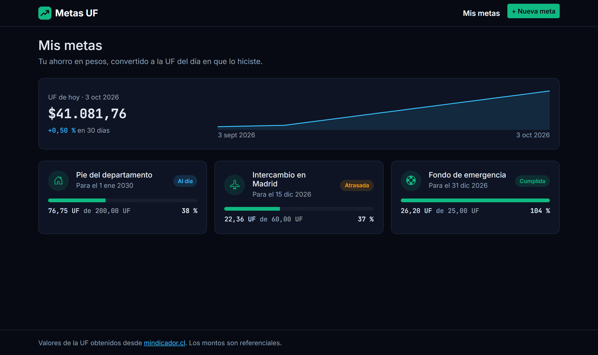
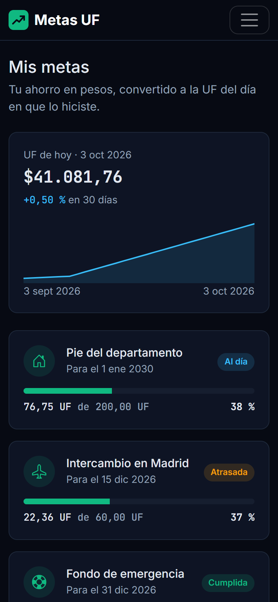
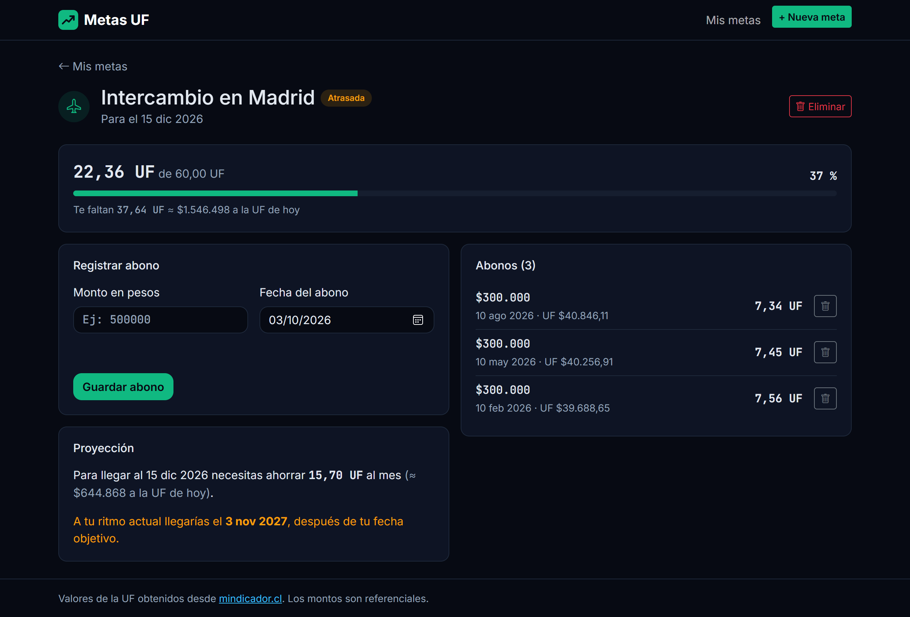
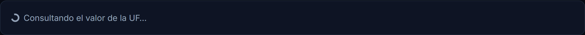
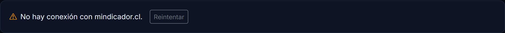

# Metas UF

Aplicación web para seguir metas de ahorro expresadas en UF cuando el ahorro se hace en pesos.

Taller Evaluado 2 — Desarrollo Web y Móvil, segundo semestre 2026.



## Integrantes

| Nombre | Usuario GitHub | Aporte principal |
|---|---|---|
| Lucas Maulén Riquelme | [maudevdigital](https://github.com/maudevdigital) | Estructura base, conexión con la API, metas y abonos, panel de la UF, detalle con proyección, documentación |
| Matías Catalán Ortega | [Matias2004-cmd](https://github.com/Matias2004-cmd) y [maticata011-bit](https://github.com/maticata011-bit) | Formulario de nueva meta con validación y selector de íconos |
| Juan Soto Toledo | [JuanUnab-student](https://github.com/JuanUnab-student) | Etiquetas de estado de cada meta y pantalla vacía reutilizable |

## Problemática

Muchas metas de ahorro en Chile se fijan en UF (el pie de un departamento, un arriendo, la matrícula de un
magíster), pero la mayoría de las personas ahorra en pesos. Como la UF sube todos los días, el mismo monto en
pesos equivale a menos UF con el tiempo, y la meta se aleja sin que se note.

Ejemplo: 200 UF costaban $7.683.834 el 01-01-2025 y $8.208.164 el 28-09-2026. Quien ahorró la primera cifra en
pesos quedó $524.330 corto.

Metas UF convierte cada abono a la UF **del día en que se hizo** y muestra el avance real hacia la meta.

## Usuarios objetivo

Estudiantes y personas jóvenes que ahorran en pesos (cuenta vista, cuenta corriente, depósito en pesos) para un
objetivo que se cobra en UF.

## Funcionalidades principales

- Crear metas de ahorro con nombre, ícono, objetivo en UF y fecha límite, con validación de cada campo.
- Registrar abonos en pesos: antes de guardar se muestra cuántas UF son según la UF de esa fecha.
- Ver el avance de cada meta y cuánto falta, en UF y en pesos.
- Ver el estado de cada meta: **al día**, **atrasada**, **vencida** o **cumplida**.
- Proyectar cuánto hay que ahorrar al mes y cuándo se cumplirá la meta al ritmo actual.
- Consultar el valor de la UF de hoy y su evolución en los últimos 30 días.
- Eliminar abonos y metas (al eliminar una meta también se eliminan sus abonos).
- Mensajes de carga, error y reintento cuando la API no responde.

## Diseño

La identidad visual (tema oscuro, tarjetas, colores y tipografías) se tomó del
[prototipo en Figma](https://www.figma.com/design/g7nt3F4EhSGpLvTSObKu4t) que el equipo usó como referencia.
Sobre esa base se definieron tres vistas y un flujo principal antes de programar las funcionalidades.

### Mapa de navegación

| Ruta | Vista | Contenido |
|---|---|---|
| `/` | Mis metas | Panel de la UF de hoy y tarjetas de cada meta |
| `/metas/nueva` | Nueva meta | Formulario de creación |
| `/metas/:id` | Detalle de meta | Avance, registro de abonos, proyección e historial |
| `*` | Página no encontrada | Enlace de vuelta al inicio |

### Flujo principal

Mis metas → Nueva meta → Crear → Mis metas → Detalle → Registrar abono → Avance, estado y proyección actualizados

### Jerarquía visual

1. El número importa más que el texto: montos y UF en fuente monoespaciada y en negrita.
2. Cada meta es una tarjeta completa que funciona como enlace a su detalle.
3. El verde se reserva para el avance y la acción principal; el ámbar y el rojo, para alertas y errores.

### Componentes repetibles

`MetaCard`, `BarraProgreso`, `EtiquetaEstado`, `EstadoVacio`, `FormMeta`, `FormAbono`, `PanelUF`, `GraficoUF`,
`HistorialAbonos` y `ProyeccionMeta`.

### Colores y tipografías

| Uso | Color |
|---|---|
| Fondo / superficie | `#070a13` / `#0e1424` |
| Texto / texto suave | `#e2e8f0` / `#94a3b8` |
| Avance y acción principal | `#10b981` |
| Información (gráfico, etiqueta al día) | `#38bdf8` |
| Alerta (meta atrasada) | `#f59e0b` |
| Error (meta vencida, fallos) | `#f43f5e` |

Tipografías: **Inter** para el texto y **JetBrains Mono** para los números.

| Celular | Detalle en escritorio |
|---|---|
|  |  |

## Tecnologías

React 19, Vite, React Router, Bootstrap 5, Bootstrap Icons, CSS propio, Fetch API y localStorage. No hay backend.

## Cómo ejecutar

Requiere Node.js 20 o superior.

```bash
npm install
npm run dev
```

La aplicación queda en http://localhost:5173.

## Estructura

```
src/
├── components/   piezas reutilizables
│   ├── Navbar, Footer                  barra superior y pie con la fuente de los datos
│   ├── MetaCard, BarraProgreso         tarjeta de meta y su barra de avance
│   ├── EtiquetaEstado, EstadoVacio     estado de una meta y mensaje de lista vacía
│   ├── FormMeta, FormAbono             formularios con validación
│   ├── PanelUF, GraficoUF              UF de hoy y gráfico de 30 días
│   └── HistorialAbonos, ProyeccionMeta historial y proyección del detalle
├── pages/        una vista por ruta (Inicio, NuevaMeta, DetalleMeta, NoEncontrada)
├── data/         metas.json y abonos.json: datos de ejemplo para la primera visita
├── hooks/        useMetas (metas y abonos + localStorage) y useUF (valor de la UF)
├── services/     mindicador.js: la única parte que llama a la API
├── utils/        formato.js, fechas.js, ahorro.js (avance y estado) y proyeccion.js
├── styles/       theme.css (paleta y ajustes sobre Bootstrap), formulario.css y etiquetas.css
├── App.jsx       rutas y estado principal
└── main.jsx      punto de entrada
public/
└── logo.svg      logo y favicon
docs/
├── capturas/     imágenes de la aplicación
└── presentacion/ presentación del taller (presentacion.pdf)
```

## Datos sin backend

1. En la primera visita, las metas y los abonos se cargan desde `src/data/metas.json` y `src/data/abonos.json`.
2. `useMetas` los mantiene en el estado de React; crear o eliminar una meta o un abono actualiza ese estado.
3. Cada cambio se guarda en localStorage (`metas-uf:metas` y `metas-uf:abonos`), así sobrevive a una recarga.
4. Cada abono guarda la UF del día en que se hizo (`valorUF`). Su equivalencia no cambia y el historial
   funciona aunque la API no responda.

Para volver a los datos de ejemplo: DevTools (F12) → Application → Local Storage → borrar las dos claves.

## API pública: mindicador.cl

- **Documentación:** https://mindicador.cl
- **Autenticación:** no requiere clave y se puede llamar directamente desde el navegador.
- **Método:** GET.

| Endpoint | Parámetros | Uso en la aplicación |
|---|---|---|
| `https://mindicador.cl/api/uf` | Ninguno | Valor de hoy y gráfico de los últimos 31 días (panel del inicio) |
| `https://mindicador.cl/api/uf/{dd-mm-aaaa}` | Fecha del abono | UF de esa fecha para convertir el abono (formulario del detalle) |

**Justificación:** sin el valor de la UF de cada fecha no es posible calcular cuánto avanza un abono hecho en
pesos. La API es la base del cálculo, no un complemento visual.

**Datos que se usan:** de cada elemento de `serie`, solo `fecha` (recortada a AAAA-MM-DD) y `valor` (pesos por UF).

**Si la API falla:**

| Situación | Mensaje |
|---|---|
| Sin conexión o más de 10 s sin respuesta | "No hay conexión con mindicador.cl." |
| La API responde con error | "mindicador.cl no pudo entregar el valor de la UF." |
| La fecha no tiene valor | "No hay valor de la UF para esa fecha." |
| La API responde sin valores | "mindicador.cl no entregó valores de la UF." |

El panel del inicio ofrece un botón **Reintentar**, y el formulario de abono no deja guardar mientras no tenga
la UF de la fecha elegida.

| Cargando | Error |
|---|---|
|  |  |

**Uso:** la aplicación consulta una vez al cargar y una vez por cada fecha elegida en un abono. La UF futura solo
existe hasta el día 9 del mes siguiente. Se da crédito a mindicador.cl en el pie de página.

## Recursos de terceros

| Recurso | Uso | Licencia |
|---|---|---|
| [Bootstrap](https://getbootstrap.com) | Grilla, formularios y componentes base | MIT |
| [Bootstrap Icons](https://icons.getbootstrap.com) | Íconos de las metas | MIT |
| [Inter](https://fonts.google.com/specimen/Inter) y [JetBrains Mono](https://fonts.google.com/specimen/JetBrains+Mono) | Tipografías (Google Fonts) | SIL Open Font License |
| [mindicador.cl](https://mindicador.cl) | Valor de la UF | Servicio gratuito; se cita la fuente en la app |

## Trabajo con Git

- `main` guarda la versión entregada y `develop` integra el trabajo del equipo.
- Cada funcionalidad se hizo en su propia rama `feature/` y entró a `develop` mediante un pull request.
- Ramas usadas: `estructura-base`, `api-uf`, `metas`, `panel-uf`, `detalle-meta`, `nueva-meta`, `estados`,
  `ajustes-finales` y `documentacion`.

## Uso de Inteligencia Artificial

| Herramienta | Propósito | Consulta representativa | Resultado | Modificación humana | Aprendizaje |
|---|---|---|---|---|---|
| Claude Code | Apoyo en la estructura del proyecto, el servicio de la API, los hooks, los componentes, la revisión de los pull requests y la documentación | "Crea el servicio de mindicador.cl y un hook con estados de carga y error" | Propuestas de código y explicaciones que se probaron contra la API y en el navegador antes de integrarlas | El código se transcribió y revisó a mano, se ajustaron nombres y textos al español, se reemplazaron los emojis por Bootstrap Icons y cada rama se probó en el navegador antes de integrarla a `develop` | Por qué cada abono debe guardar la UF de su fecha, por qué un `useEffect` que consulta una API necesita limpieza al cambiar la fecha, y por qué las fechas se arman en hora local para no mostrar el día anterior |

## Limitaciones conocidas

- Los datos se guardan en el navegador (localStorage): no se comparten entre dispositivos.
- Una meta no se puede editar; para cambiarla hay que eliminarla y crearla de nuevo.
- La UF futura solo se conoce hasta el día 9 del mes siguiente; las proyecciones usan la UF de hoy y son aproximadas.
- La fecha estimada de cumplimiento necesita al menos un mes de abonos.
- mindicador.cl es un servicio gratuito sin garantía de disponibilidad; sin él no se pueden registrar abonos nuevos.
